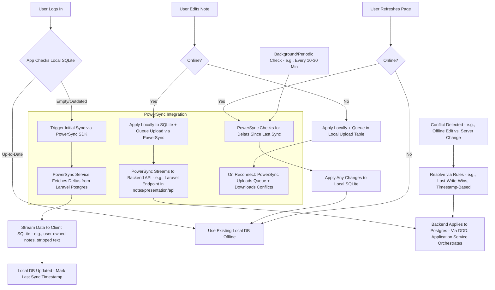

## Fast search diagram

```mermaid
flowchart TD
    A[User Logs In] --> B{App Checks Local SQLite}
    B -->|Empty/Outdated| C[Trigger Initial Sync via PowerSync SDK]
    C --> D[PowerSync Service Fetches Deltas from Laravel Postgres]
    D --> E[Stream Data to Client SQLite - e.g., user-owned notes, stripped text]
    E --> F[Local DB Updated - Mark Last Sync Timestamp]
    B -->|Up-to-Date| G[Ready for Use - Offline-Capable]

    H[User Refreshes Page] --> I{Online?}
    I -->|Yes| J[PowerSync Checks for Deltas Since Last Sync]
    J --> K[Apply Any Changes to Local SQLite]
    K --> G
    I -->|No| G[Use Existing Local DB Offline]

    L[User Edits Note] --> M{Online?}
    M -->|Yes| N[Apply Locally to SQLite + Queue Upload via PowerSync]
    N --> O[PowerSync Streams to Backend API - e.g., Laravel Endpoint in notes/presentation/api]
    O --> P[Backend Applies to Postgres - Via DDD: Application Service Orchestrates]
    M -->|No| Q[Apply Locally + Queue in Local Upload Table]
    Q --> R[On Reconnect: PowerSync Uploads Queue + Downloads Conflicts]

    S[Background/Periodic Check - e.g., Every 10-30 Min] --> J

    T[Conflict Detected - e.g., Offline Edit vs. Server Change] --> U[Resolve via Rules - e.g., Last-Write-Wins, Timestamp-Based]
    U --> P

    subgraph "PowerSync Integration"
    C
    D
    J
    N
    O
    R
    end
```