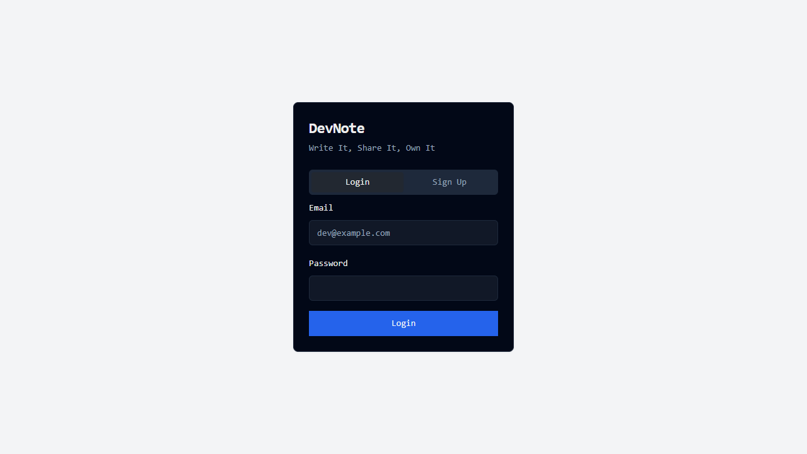
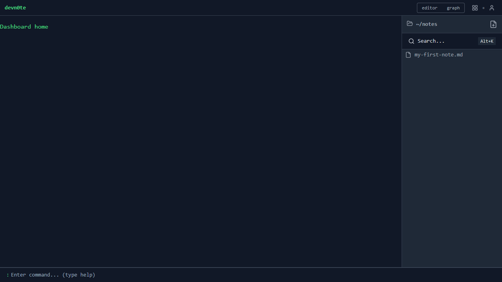
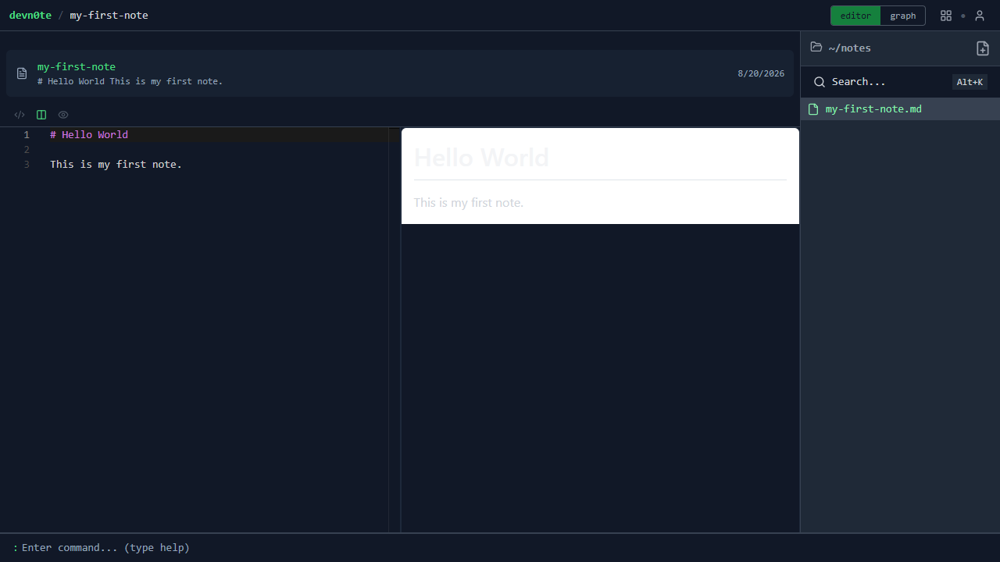
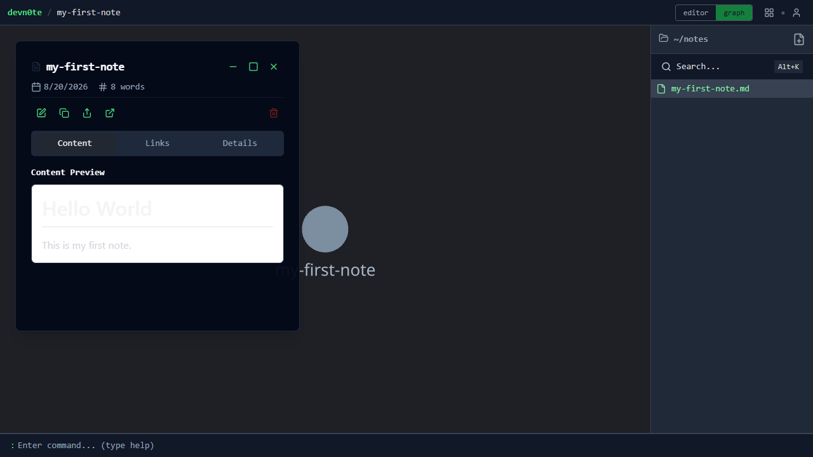
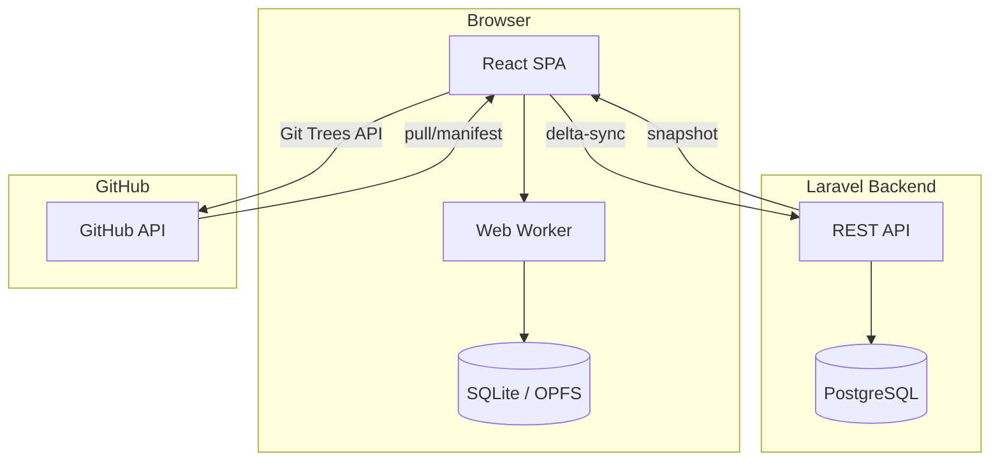

<div align="center">

```
╔═══════════════════════════════════════╗
║  d e v n 0 t e                        ║
║  your notes. your rules. your stack.  ║
╚═══════════════════════════════════════╝
```

[](https://www.php.net/)
[](https://laravel.com/)
[](https://react.dev/)
[](https://www.typescriptlang.org/)
[](https://vitejs.dev/)
[](https://opensource.org/licenses/MIT)

</div>

---

## What is devn0te?

A self-hosted, local-first markdown note-taking app. I built it because I wanted two things: to learn Laravel properly (with domain-driven design, not just "controllers everywhere"), and to handle my notes the way *I* actually want, no vendor lock-in, no "your notes are stored on our servers," no feature bloat hiding behind a paywall.

Notes live in SQLite in your browser. When you're online, they sync to a Laravel backend via delta-sync. There's a GitHub connector for pushing notes to a repo, wiki-links for connecting ideas, a graph view for seeing the connections, and a terminal console because some of us prefer keyboards to mouse clicks.

It's a learning project and a real tool at the same time. The kind of thing you build when "just use Notion" isn't quite enough.

---

## Screenshots









---

## Features

### Writing & Editing

- **Markdown editor**: Monaco editor with syntax highlighting, a custom vim-dark theme, and three view modes (editor, split, preview). Wiki-link completion triggers on `[[`.
- **Note titles**: alphanumeric with hyphens and underscores only (`^[a-zA-Z0-9_-]+$`), max 50 characters, no spaces. Leading/trailing hyphens and double hyphens are not allowed.
- **Live preview**: renders markdown with `react-markdown`, `remark-gfm`, `rehype-raw`, and `rehype-highlight`. GFM tables, task lists, and fenced code blocks with syntax highlighting all work.
- **Autosave**: 2-second debounced saves with an unsaved-changes guard and a save-state indicator. You write, it saves. No "Did you save?" panic.
- **Command palette**: `Ctrl+Shift+P` opens a quick-action palette for New Note, Search, and Delete.

### Organization

- **Wiki-links**: type `[[` and pick a note. Links resolve to `devnote://note/{connectorId}` URIs. Backlinks and outgoing links are tracked.
- **Graph view**: interactive node graph (reagraph) showing all note connections. Select a node to navigate, or use it to discover clusters of related notes.
- **Spotlight search**: `Alt+K` opens a fuzzy search overlay powered by SQLite FTS5 with a `fuse.js` fallback. Includes match highlighting and a preview pane.
- **Import/export**: export all notes as a `.zip` of frontmatter `.md` files (via `fflate`). Import individual `.md` files.

### Sync & Storage

- **Local-first**: SQLite lives in a Web Worker (OPFS-backed, IndexedDB fallback). Notes are stored locally and sync to the server when you're online.
- **Server delta-sync**: device cursors track what each device has seen. Only changed notes are pulled. Tombstones handle deletions across devices.
- **Batch push**: local changes (created/updated/deleted) are pushed to the server in one batch.
- **Full snapshot sync**: a one-shot sync for when you need to pull everything down.

### Connectors

- **GitHub connector**: pull notes from a GitHub repo (manifest cursor, frontmatter parsing) and push notes back (Git Trees API, one atomic commit per sync). Token stored only in your browser's localStorage.
- **Connector health check**: checks whether the GitHub connection is still valid.

### Sharing

- **Note sharing**: make a note public, password-protected, or private. Share via a unique URL. Public notes get a clean reader view; password-protected notes show a password dialog.

### Power Features

- **Terminal console**: in-app terminal with `help`, `new-note`, `delete-note`, `ls`, `clear`, tab-completion, and command history.
- **PWA**: installable as a Progressive Web App. Manifest and meta tags are configured. *(Note: no service worker yet, so it can't load offline from the home screen.)*
- **Config endpoint**: `GET /api/v1/config` tells the frontend whether server sync is enabled.

---

## Table of Contents

- [What is devn0te?](#what-is-devn0te)
- [Screenshots](#screenshots)
- [Features](#features)
- [Quick Start](#quick-start)
- [Detailed Setup](#detailed-setup)
- [Environment Variables](#environment-variables)
- [How It Works](#how-it-works)
- [Roadmap / Open Items](#roadmap--open-items)
- [Testing](#testing)
- [License](#license)

---

## Quick Start

### Prerequisites

Before you begin, make sure you have these installed:

- **Docker** and **Docker Compose**: used to run the backend server and database. Install from [docs.docker.com/get-docker/](https://docs.docker.com/get-docker/).
- **Node.js 20+**: used to run the frontend. Install from [nodejs.org](https://nodejs.org/). You can check your version with `node --version`.

### Step 1: Clone the repository

```sh
git clone https://github.com/guidogr95/devn0te.git
cd devn0te
```

This downloads the project code and moves you into the project folder.

### Step 2: Start the backend and database

```sh
docker compose up -d
```

This starts the Laravel backend server and a PostgreSQL database in Docker containers. The `-d` flag runs them in the background. Wait about 10 seconds for everything to initialize.

### Step 3: Configure the backend environment

```sh
cp backend/.env.example backend/.env
docker compose exec backend php artisan key:generate
```

The first command creates a `.env` configuration file from the provided example. The second command generates a random encryption key that Laravel needs to run.

### Step 4: Set up the database

```sh
docker compose exec backend php artisan migrate
```

This creates all the database tables that the app needs (users, notes, sync cursors, etc.). You should see a list of "Migration" confirmations in the output.

### Step 5: Create the authentication client

```sh
docker compose exec backend php artisan passport:client --personal
```

This creates a Laravel Passport client that the frontend uses to authenticate API requests. After running it, you will see output like:

```
Personal access client created successfully.
Client ID: 1
Client secret: abc123...
```

Copy and save the **Client ID** and **Client Secret** if you need them later, though the frontend `.env` does not require them.

### Step 6: Start the frontend

Open a **new terminal window** (keep the backend running in the first one), then run:

```sh
cd frontend
cp .env.example .env
npm install
npm run dev
```

Line by line:

1. `cd frontend` moves into the frontend directory.
2. `cp .env.example .env` creates the frontend environment file.
3. `npm install` downloads all the JavaScript dependencies (this may take a minute the first time).
4. `npm run dev` starts the Vite development server.

### Step 7: Open the app

Once the frontend starts, you will see output like:

```
Local: http://localhost:5173/
```

Open that URL in your browser. You should see the devn0te login page.

| Service        | URL                      |
|----------------|--------------------------|
| Frontend       | http://localhost:5173     |
| Backend API    | http://localhost:8000     |
| PostgreSQL     | localhost:5433            |

### Step 8: Create your first note

1. Click **Register** and create an account with a name, email, and password.
2. Once logged in, click the **+** button (or press `Ctrl+Shift+P` and select "New Note") to create a note.
3. Give your note a title. Note titles can only contain letters, numbers, hyphens, and underscores (no spaces), with a maximum of 50 characters.
4. Start writing markdown in the editor. Your note saves automatically.

You're off. Explore the sidebar, try the graph view, or connect a GitHub repo.

---

## Detailed Setup

### Backend

The backend is a Laravel 11 API with two bounded contexts: **Notes** (CRUD, sync, sharing) and **Connectors** (GitHub integration). Authentication uses Laravel Passport personal access tokens.

```sh
# From the project root
cp backend/.env.example backend/.env
docker compose up -d

# Generate app key (required - the app won't start without it)
docker compose exec backend php artisan key:generate

# Run migrations
docker compose exec backend php artisan migrate

# Create the Passport personal access client (required for auth)
docker compose exec backend php artisan passport:client --personal
```

> **Tip:** If register or login returns 500 with "Personal access client not found", you need to run the `passport:client` command above. A database reset wipes the client row, so re-run it after any `migrate:fresh`.

### Frontend

The frontend is a React 19 SPA with Vite 6, Redux Toolkit, TanStack Router, and Monaco editor. It runs as a dev server on port 5173.

```sh
cd frontend
cp .env.example .env
npm install
npm run dev
```

### Docker Compose

The `docker-compose.yml` brings up:

- **backend**: Laravel app on port `8000`
- **db**: PostgreSQL 15 on port `5433` (mapped from container port `5432`)

The frontend is not in the compose file. Run it separately with `npm run dev`.

---

## Environment Variables

### Backend (`backend/.env`)

| Variable              | Purpose                                                         | Required | Default            |
|-----------------------|-----------------------------------------------------------------|----------|--------------------|
| `APP_KEY`             | Laravel encryption key: **you must generate this**              | Yes      | *none*             |
| `APP_ENV`             | Environment: `local`, `testing`, `production`                    | Yes      | `local`            |
| `APP_DEBUG`           | Show detailed error pages in the browser                         | No       | `true`             |
| `APP_URL`             | Base URL of the backend                                          | No       | `http://localhost`  |
| `SERVER_SYNC_ENABLED` | Toggle server delta-sync on/off                                  | No       | `true`             |
| `DB_CONNECTION`       | Database driver (`pgsql` in Docker, `sqlite` locally)            | Yes      | `pgsql`            |
| `DB_HOST`             | PostgreSQL host                                                  | Docker   | `db`               |
| `DB_PORT`             | PostgreSQL port                                                  | Docker   | `5432`             |
| `DB_DATABASE`         | Database name                                                    | Docker   | `pgsqldb`          |
| `DB_USERNAME`         | Database user                                                    | Docker   | `my_user`          |
| `DB_PASSWORD`         | Database password                                                | Docker   | `my_password`      |

The `.env.example` also includes standard Laravel variables for logging, sessions, cache, queue, mail, Redis, and AWS S3. These work out of the box for local development and don't need changes.

### Frontend (`frontend/.env`)

| Variable            | Purpose                             | Required | Default                 |
|---------------------|-------------------------------------|----------|-------------------------|
| `VITE_API_BASE_URL` | Base URL of the Laravel backend API | Yes      | `http://localhost:8000` |

---

## How It Works

### Local-First Architecture

The local SQLite database is the source of truth on the device. When you're online, changes sync to the Laravel backend using delta-sync: each device tracks its position via `device_sync_cursors`, so only notes changed since the last sync are transferred. Tombstones mark deletions so other devices can reconcile.



### Backend DDD

The backend is organized into bounded contexts (`Notes` and `Connectors`), each split into Domain, Application, Infrastructure, and Presentation layers. Auth lives outside these contexts; Passport manages tokens via its own `oauth_*` tables.

```
backend/app/
├── Notes/                    Notes bounded context
│   ├── Domain/               Entities, value objects, domain events
│   ├── Application/          Service interfaces and implementations
│   ├── Infrastructure/       Eloquent models, repositories
│   └── Presentation/         API controllers
├── Connectors/               Connectors bounded context (GitHub)
│   ├── Domain/
│   ├── Application/
│   ├── Infrastructure/
│   └── Presentation/
├── Http/                     Auth + config controllers
├── Console/Commands/         Artisan commands
├── Models/                   Shared Eloquent models
├── Policies/                 Authorization policies
├── Providers/                Service providers
├── Repositories/             Repository interfaces
└── Services/                 Shared services
```

### Frontend Modules

The React app is split into feature modules following a `core/`, `hooks/`, `interface/`, `redux/`, `ui/` layout within each module. Routes are file-based via TanStack Router's `.lazy.tsx` convention.

```
frontend/src/
├── modules/            Feature modules
│   ├── auth/           Authentication (register, login)
│   ├── config/         App configuration
│   ├── connectors/     GitHub connector UI
│   ├── console/        In-app terminal
│   ├── dashboard/      Dashboard layout
│   ├── login/          Login page
│   ├── nodes/          Graph view (reagraph)
│   ├── notes/          Note editor, list, preview
│   └── shared/         Public shared-note viewer
├── routes/             TanStack Router file-based routes
├── redux/              Redux store configuration
├── core/               Shared types, constants, utilities
├── config/             Routing config, app configuration
├── layouts/            Page layouts
├── styles/             Global styles
└── utils/              Utility functions
```

---

## Roadmap / Open Items

Not everything is done. Here's an honest summary of what's still in progress, what's limited, and what would be nice to add.

### Not Finished

- **PWA offline gap**: the manifest is configured and the app is installable, but there's no service worker. Once you close the tab, you can't reload from the home screen without a network connection.
- **Placeholder pages**: the root `/` and `/dashboard/` routes exist but don't have real content yet.
- **Inert sidebar buttons**: "Users", "Settings", and the "Duplicate" menu item don't do anything.
- **Header title editing**: you can click to edit a note title in the header, but it doesn't save.
- **Shared-note viewer**: the public viewer works but is basic. Password-protected notes show a dialog but the view itself is minimal.

### Known Limitations

- **Editor loads from server**: note content is fetched from the Laravel backend, not from local SQLite. If you're offline and haven't opened a note this session, you can't open it.
- **Redundant double-push**: sync can trigger a push twice in some cases. Harmless but wasteful.
- **Equal-timestamp rows**: in rare cases, two notes with identical `updated_at` timestamps can be skipped during delta sync.
- **Shared-note password hash**: the shared-note response includes the password hash field. Shouldn't be exposed.

### Nice-to-Haves

These are grounded in the existing architecture but not yet implemented:

- Tags / frontmatter extraction
- Note templates
- Pinned notes
- Note versioning / history
- More connectors (S3/R2 are already scaffolded in the backend)
- Conflict resolution UI for sync collisions

---

## Testing

### Backend

```sh
cd backend

# Code style (Pint)
./vendor/bin/pint --test

# Static analysis (PHPStan)
./vendor/bin/phpstan analyse --memory-limit=1G

# Tests (PHPUnit)
./vendor/bin/phpunit
```

### Frontend

```sh
cd frontend

# Lint
npm run lint

# Type check
npx tsc -b

# Build
npm run build

# Tests (Vitest)
npm run test:run
```

---

## Project Structure

```
devn0te/
├── backend/               Laravel 11 API
│   ├── app/               Bounded contexts (Notes, Connectors)
│   ├── database/          Migrations, seeders
│   ├── routes/api.php     API routes
│   └── tests/             PHPUnit tests
├── frontend/              React 19 SPA
│   └── src/
│       ├── modules/       Feature modules
│       ├── routes/        TanStack Router routes
│       └── redux/         Redux store
└── docker-compose.yml     Local dev environment
```

---

## License

This project is licensed under the [MIT License](https://opensource.org/licenses/MIT).
